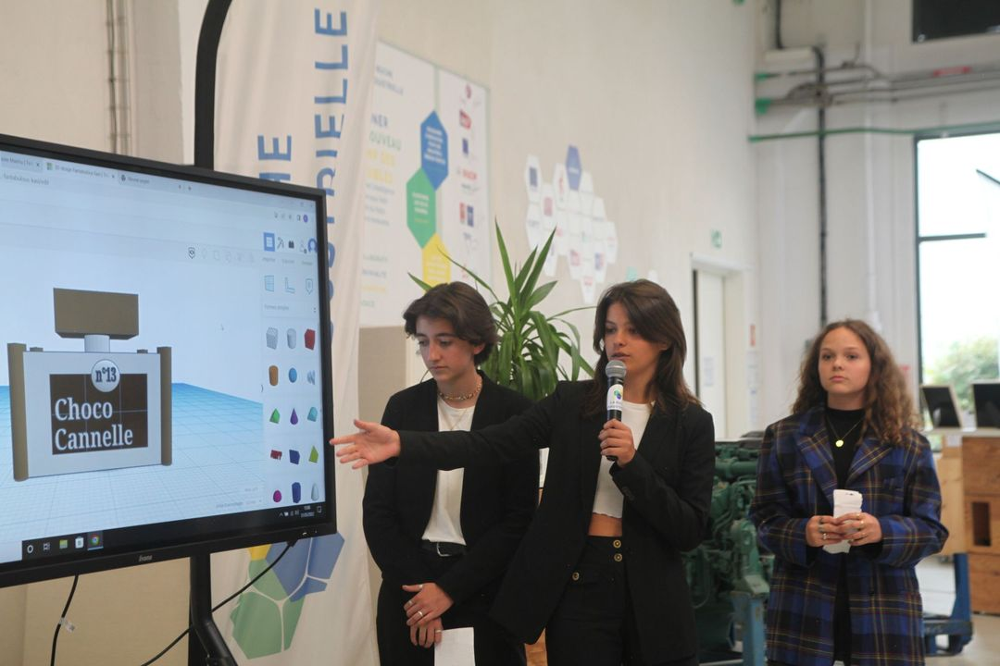

# Projet collaboratif et interdisciplinaire permettant à des élèves de travailler avec un intervenant industriel et des structures territoriales associées

Génèse des CCN
Il y a bientôt 20 ans Erasme initiait les Classes Culturelles Numériques (CCN) en accompagnant chaque année plus de 60 classes (1500-3000 élèves) du CM1 à la 3ème. Tout au long de l’année scolaire, chaque classe, encadrée par un enseignant et un professionnel externe, réfléchit et produit de manière collaborative en lien avec des sujets aussi variés que le zéro déchet, les usages urbains, le cinéma, la musique électronique, les archives, l’écriture ou encore le théâtre. Ces projets CCN permettent aux élèves non seulement de découvrir des métiers par la rencontre avec un professionnel mais également d’acquérir des compétences numériques (recherche documentaire, protection des données personnelles…) notamment via l’utilisation d’un outil en ligne : laclasse.net, lui-même initialement conçu et produit par Erasme.

Ajout du thème industriel
Depuis 2020 la thématique industrielle a été ajoutée aux CCN à titre expérimental. Les élèves ont eu l’opportunité de concevoir et de créer un flacon de parfum accompagnés par Bruno Champauzac, ingénieur du groupe Thalès. L’analyse des pratiques et usages des designs de parfums célèbres a permis aux élèves de rédiger un cahier des charges adapté aux besoins de leurs futurs clients. Ils ont ensuite créé un prototype du flacon et de son emballage ainsi que des supports de communication accompagnant la sortie du produit. Ils ont ainsi pu aborder des sujets tels que la production à grande échelle, le marketing ainsi que le design thinking.

En 2021, en partenariat avec le Campus Lumière une seconde thématique a été ajoutée avec pour objet l’industrie de la lumière et de l’éclairage. Les élèves ont pu s’interroger sur son importance dans leur quotidien ainsi qu’à une utilisation plus responsable des éclairages. Aidés de Jérôme Donna, éclairagiste et artiste lumière de la Ville de Lyon, chaque classe a sélectionné un lieu son choix à transformer ou valoriser grâce à la lumière. Ils ont ensuite imaginé une scénographie qu’ils ont présentée sous forme de croquis, plans 3D ou dessins, accompagnée d’une fiche technique précisant le matériel nécessaire requis. En 2022 un kit technique (ruban LED, variateur) sera fourni à chaque classe.

En 2022 en partenariat avec UNITEX (organisation professionnelle) et Text'In (campus des qualifications) l’industrie textile vient enrichir le programme, avec un travail de design et d’éco-conception d’un sac à dos. Ce projet permettra aux élèves de découvrir les principes de l’économie circulaire et de sa familiariser avec les techniques et métiers du secteur. Les collégiens sont accompagnés par Jean-Baptiste Martin, designer de mode spécialiste des vêtements et accessoires de sport et plein air. Les élèves de collège concevront les sacs et réaliseront des maquettes puis en fin d'année scolaire des lycéens (bac pro) interviendront pour la phase de prototypage avancée. De nombreux partenariats, interventions et événements viennent enrichir ce parcours pédagogique. Les matériaux utilisés seront principalement des vêtements professionnels à recycler fournis la Métropole de Lyon.
‍

Partenaires généraux : DRANE, DRAFPIC, Académie
Accompagnement et médiation : Réseau Canopé
Remerciements : La Ruche Industrielle, Institut Lumière, Jtekt



